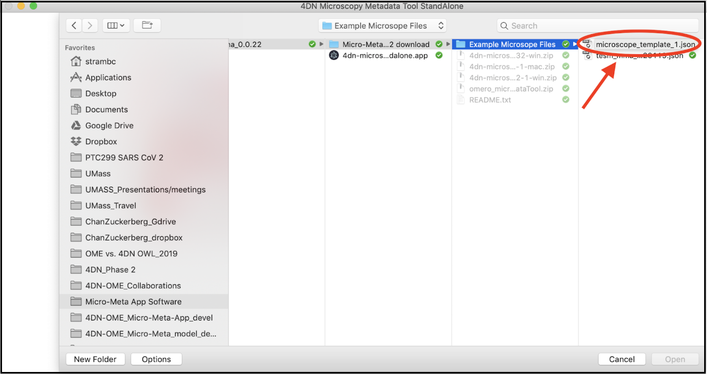
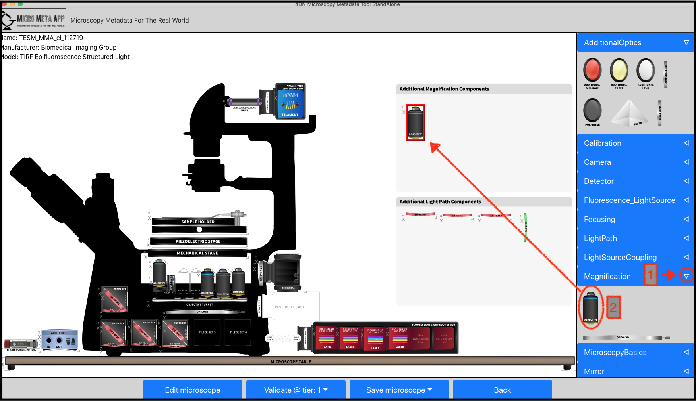

******************************************
A. Managing Microscope Specification files
******************************************
Please follow these step by step instructions.

A.1 Selecting Tier level
========================
Click on the "Tier" selector and select the Tier level you are interested in and click on “Manage Instrument”.

.. tip::

  Please note that a Microscope metadata file that has been opened at a given Tier level can be validated and saved at a lower level, thus facilitating the work required for full documentation by allowing it to be done over multiple sessions.

.. .. figure:: images/use_images/01_Select-Tier_1.png
..   :class: shadow-image
..   :width: 90%
..   :align: center

.. Figure 1: Click on the Tier selection menu.

.. ------

.. figure:: images/use_images/02_Select-Tier_2.png
  :class: shadow-image
  :width: 90%
  :align: center

  Figure 1: Select the desired Tier level.

A.2 Creating or Opening a Microscope file
=========================================
After selecting the desired Tier level, select one of the four options by clicking on the on the "Create mode selector" button. “Create Inverted from scratch” and “Create Upright from scratch” allow to create a new Inverted or Upright Microscope file, respectively. “Load from file” allows to import a Microscope file that has not been loaded in the App yet (i.e., a Microscope file you might have received from someone else). “Load from repository” allows to work on a Microscope file that has already been imported in the App and you might need to modify.

A.2.1 Creating from scratch
---------------------------
After selecting one of the two “Create Inverted/Upright from scratch”, hit “Continue” and an empty Canvas will appear. To start building a new Microscope file, first hit “Edit Microscope”, enter the required attributes and hit “Confirm”. To add Hardware components follow instructions below.

A.2.2 Loading from file
-----------------------
After selecting “Load from file”, click on "Select an existing Microscope file you want to work on.", select the desired Microscope file (e.g., those provided as Example Files with the App), click “Open” and then hit “Continue”.

  Figure 2: Select the desired Microscope file to open.

A.2.3 Loading from the Repository/Home folder
---------------------------------------------
Step 1
^^^^^^
Select “Load from repository” to open an existing Microscope file to edit, and hit “Continue”.

.. figure:: images/use_images/06_Load_from_repository_1.png
  :class: shadow-image
  :width: 90%
  :align: center

  Figure 3: Select “Load from repository” to open an existing Microscope file to edit.

Step 2
^^^^^^
First select the Manufacturer of the Microscope and then select the desired Microscope file you need to edit.

.. figure:: images/use_images/07_Load_from_repository_2.png
  :class: shadow-image
  :width: 90%
  :align: center

  Figure 4: Select the desired manufacturer and Microscope file from those available in the Repository/Home folder.

A.3 Adding and Editing Hardware components to the Canvas
========================================================
After opening a new or an existing Microscope file, if available all pre-existing Hardware components will appear on the Canvas. In this example the TIRF Epi-Fluorescence Structured Light Microscope `(TESM) <https://trello.com/b/BQ8zCcQC/tirf-epi-fluorescence-structured-light-microscope>`_ custom built at the University of Massachusetts Medical School `Program in Molecular Medicine <https://www.umassmed.edu/pmm>`_ by members of the `Bio-Medical Imaging Group <http://big.umassmed.edu>`_, is displayed with several existing components.

.. tip::

  At any time in the process it is possible to click on the "Back" button to return to the the opening screen to work on a different Microscope metadata file or to choose a different Tier level for the current Microscope.

.. figure:: images/use_images/08_Open_Microscope.png
  :class: shadow-image
  :width: 90%
  :align: center

  Figure 5: The opened TESM Microscope file with existing Hardware components.

Step 1
------
In order to add additional Hardware components, select and open one of the sections [1] on the right panel, and select a new element to add [2]. In this example, we are selecting and adding a new Objective to the Canvas.

  Figure 6: Add a new Objective component to the Microscope canvas.

Step 2
------
A newly added element will appear with a red box around it indicating that metadata values are missing and that the component is not validated. In order to enter metadata values, click on the element to open the associated form.
Fields that are mandatory for the Tier-validation level you have selected are marked by an asterisk. After entering metadata values, when you click “Confirm” the App will take you to fields (marked by red error messages) that are still missing and need to be filled in to complete validation.

.. figure:: images/use_images/10_Edit_attributes.png
  :class: shadow-image
  :width: 90%
  :align: center

  Figure 7: Edit Objective’s attributes.

-----

.. figure:: images/use_images/11_Confirm_attributes.png
  :class: shadow-image
  :width: 90%
  :align: center

  Figure 8: Enter the required Objective’s attributes and Confirm to validate.

Step 3
------
In the case of Light source, Filter, Dichroic, Prism, Polarization Optics and Detector, it is possible to add multiple Transmittance, Reflectance, and Wavelength Ranges to reflect the multi-pass nature of the component. In order to modify the number of available band-pass components click on “Add/Remove wavelength range or sub-components” and click on + or -.  IMPORTANT: before changing the number of band-pass components make sure all your work has been saved by clicking on "Confirm" because all unsave values will be lost (this is obviously not great and we are planning to fix this issue in a future release. For now please accept our apologies for the temporary inconvenience).

.. figure:: images/use_images/12_Add_Transmittance-Range.png
  :class: shadow-image
  :width: 90%
  :align: center

  Figure 9: Add the required number of Transmittance Range components to correctly describe a multi-pass Excitation filter.

A.4 Saving Microscope files
===========================
In order to facilitate entering the require microscopy hardware metadata over multiple sessions, before saving the Tier level used to validate the Microscope metadata file can be changed by clicking on the "Validate @Tier: " selector. After that, the Microscope metadata file can be can be saved to the Repository/Home folder or exported as a file by clicking on the "Save microscope" selector. Finally, after saving a Microscope metadata file, it is possible to navigate back to the Micro-Meta App opening screen to work on a different Microscope metadata file or to choose a different Tier level for the current Microscope.

.. figure:: images/use_images/14_Change_Validation-Tier.png
  :class: shadow-image
  :width: 90%
  :align: center

  Figure 10: Changing validation Tier, saving the Microscope metadata file, and navigating back to the opening screen.
