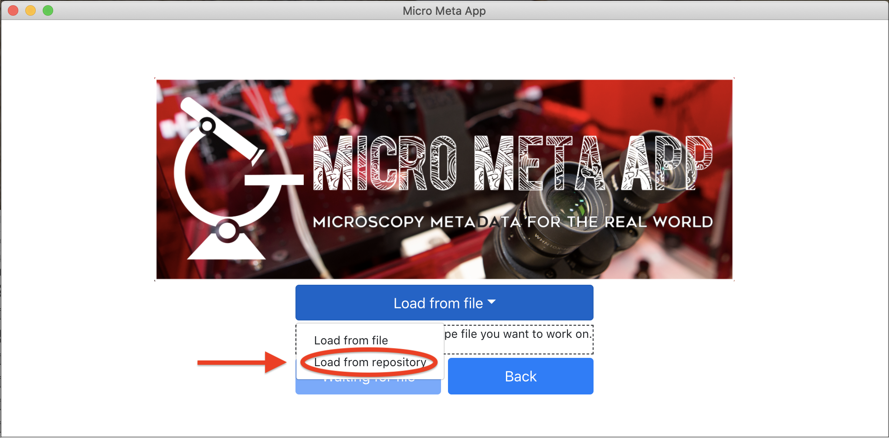
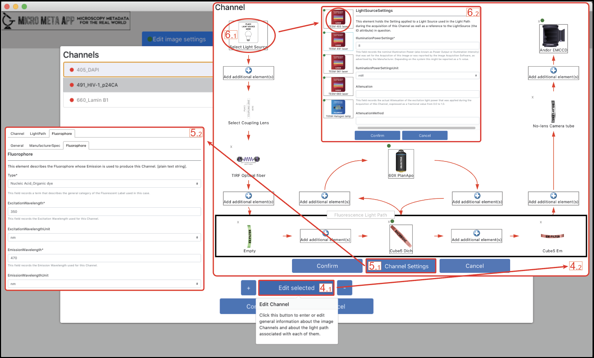

**************************************
B. Managing Acquisition Settings files
**************************************
Please follow these step by step instructions.

B.1 Selecting Tier level
========================
Click on the **Tier** selector and select the Tier level you are interested in and click on **Manage Settings**.

.. tip::

  Please note that a Settings metadata file that has been opened at a given Tier level can be validated and saved at a lower level, thus facilitating the work required for full documentation by allowing it to be done over multiple sessions.

.. .. figure:: images/use_images/01_Select-Tier_1.png
..   :class: shadow-image
..   :width: 90%
..   :align: center

.. Figure 1: Click on the Tier selection menu.

.. ------

.. .. figure:: images/use_images/02_Select-Tier_2.png
..   :class: shadow-image
..   :width: 90%
..   :align: center

..  Figure 1: Select the desired Tier level.

B.2 Selecting an existing Microscope file
=========================================
After selecting the desired Tier level, select the Microscope file describing the instrument that was used to acquire the image(s) you wich to document, among one of the available Microscope files. There are two options for doing this: **Load from file** allows to import a Microscope file that has not been loaded in the App yet (i.e., a Microscope file you might have received from someone else). **Load from repository** allows to open a Microscope file that has already been imported in the App.

B.2.1 Loading from file
-----------------------
After selecting **Load from file**, click on **Select an existing Microscope file you want to work on.**, select the desired Microscope file (e.g., one that you might have received from a colleague) , click **Open** and then hit **Continue**.

.. .. figure:: images/use_images/05_Load_from_file_2.png
..  :class: shadow-image
..  :width: 90%
..  :align: center

..  Figure 1: Select the desired Microscope file to open.

B.2.2 Loading from the Repository/Home folder
---------------------------------------------
Step 1
^^^^^^
Select **Load from repository** to open an existing Microscope file to work on, and hit **Continue**.

  Figure 1: Select **Load from repository** to open an existing Microscope file to work on.

Step 2
^^^^^^
First select the Manufacturer of the Microscope and then select the desired Microscope file you need to work on.

.. .. figure:: images/use_images/07_Load_from_repository_2.png
..   :class: shadow-image
..  :width: 90%
..  :align: center

..  Figure 4: Select the desired manufacturer and Microscope file from those available in the Repository/Home folder.

B.3 Selecting the Image to be documented
========================================
After opening the Microscope file describing the instrument that was used to acquire the image(s) you wich to document, select the Image data file that you wish to document using Micro-Meta App. After selecting **Load from file**, click on **Select an existing Image file you want to work on.**, select the desired Image file, click **Open** and then hit **Continue**.

  Figure 2: Select the Image file to be annotated.

.. tip::

  Please note that after creating a Settings file, when opeining the file a second time for editing purpueses it is possible to skip the loading of the asociated image file by selecting **Skip load image**.
  
B.4 Creating or Opening a Settings file
=======================================
After opening the Image data file that you wish to document using Micro-Meta App, select one of the thre options by clicking on the on the **Load settings file selector** button. **Create from scratch** allow to create a new Settings file. **Load from file** allows to import a Settings file that has not been loaded in the App yet (i.e., a Microscope file you might have received from someone else). **Load from repository** allows to work on a pre-existing Settings file that has already been imported in the App and you might need to modify.

B.5 Working on a Settings file
==============================
After opening a new or an existing Settings file, the application will display the main Mananage Settings canvas, which allows to enter or edit metadata values pertaining to different aspects of Image Acquisition.

.. tip::

  At any time in the process it is possible to click on the **Back** button to return to the the opening screen to work on a different Microscope or Settings metadata file.

  Figure 3: The Manage Settings window allows to enter/edit the settings utilized to acquire a specific Image.
  
B.5.1 Enter general Image acquisition settings
----------------------------------------------
Micro-Meta App allows to select the individual Microscope hardware components that were used to acquire a specific image and enter settings associated with each component. In the main window of Manage Settings, the user can access different sections of the Image Acquisition Settings metadata by pressing different buttons and launching of the corresponding metadata collection windows. 

In the example below (Figure 4), clicking the **Edit image settings** button [1.1] opens the metadata entry form for general image structure metadata associated with the image Pixels (e.g., DimensionOrder, SizeX, SizeY, SizeZ) allowing to inspect and if needed edit these values [1.2]. 

In addition, the **Edit Planes** button [2.1] opens an interface where the list of available image Planes is displayed [2.2], and individual Planes can be selected, so that associated metadata (e.g., TimeStamp, ExposureTime) can be inspected and edited [2.3]. 

Finally, the **Edit Objective Settings** button [3.1] allows to select the Objective that was used to acquire the image of interest, among those available in the Microscope file [3.2] and enter the relevant Objective Settings [3.3]. The same procedure followed for Objective Settings, can be also used to edit Imaging Environment, Microscope Table, Microscope Stand, and Sample Positioning Settings. 

  Figure 4: The Manage Settings window allows to select specific Microscope harware components and enter their associated settings.

B.5.2 Εnter/Edit basic Channel settings
---------------------------------------
Micro-Meta App allows to define the basic configuration of individual Image Channels. After clicking the **Edit Channels** button in the main Manage Settings window (Figure 4), the user opens an interface where the list of image Channels that were found in the image file header are displayed (top left) to be individually accessed and edited (button 4.1). The associated Channel interface [4.2] presents a a button called **Edit Channel Settings** [5.1] that launches a specialized window [5.2] to edit or enter general information about the Channel (i.e., IlluminationType, ContrastMethod, and, when relevant, Fluorophore). In addition, the Channel window presents an interactive user interface for managing the different components of the channel’s Light Path (i.e., LightSource --> Fluorescence Light Path --> Objective --> Detector). In this example (Figure 5), the user clicks on the **LightSource** button [6.1] to select one of the available Light Sources present in the Microscope file, add it to the Light Path and enter the associated settings that were applied during image acquisition [6.2]. 

  Figure 5: Manage Settings allows to provide basic information about the configuration of individual Image Channels.
  
  
B.5.3 Εnter/Edit advanced Channel settings
------------------------------------------
The Channel interface of Micro-Meta App can be used to manage advanced features of the Light Path associated with each Image Channel.  This is done by inserting additional optical elements at one of the seven **Add additional element(s)** [7.1] insert buttons found at key locations along the Light Path. In the example displayed (Figure 6), the insertion point located between the LightSource and the illumination port found at the back of the Microscope initially contains a Shutter, a Mirror, a Dichroic and a Beam Splitter [7.2], and the **Add** [7.3] button is used to append an additional Shutter [7.4].

  Figure 6: Manage Settings allows to provide advanced information about the configuration of individual Image Channels.
