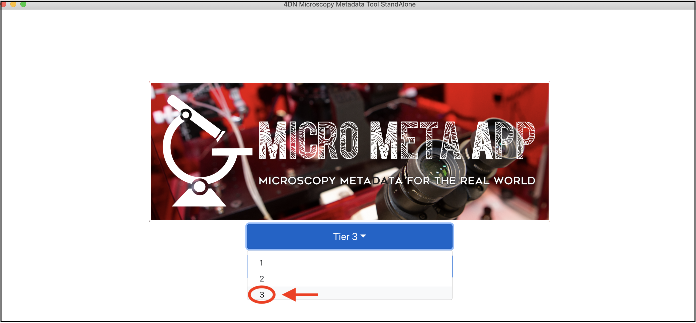
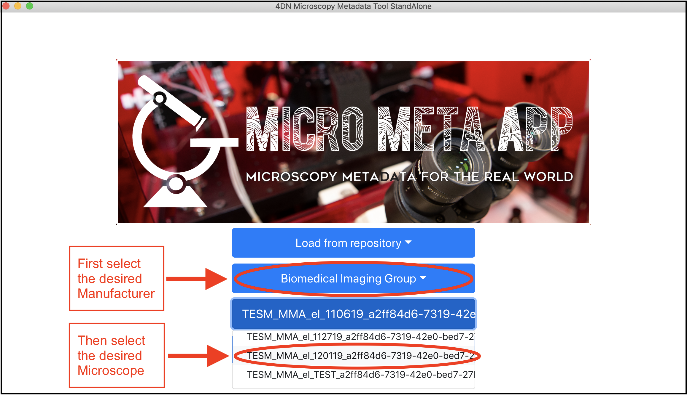

******************************************
B. Managing Microscope Specification files
******************************************
Please follow these step by step instructions.

B.1 Selecting Tier level
========================
Click on the "Tier" selector and select the Tier level you are interested in and click on “Manage Settings”.

.. tip::

  Please note that a Settings metadata file that has been opened at a given Tier level can be validated and saved at a lower level, thus facilitating the work required for full documentation by allowing it to be done over multiple sessions.

.. .. figure:: images/use_images/01_Select-Tier_1.png
..   :class: shadow-image
..   :width: 90%
..   :align: center

.. Figure 1: Click on the Tier selection menu.

.. ------

  Figure 1: Select the desired Tier level.

B.2 Selecting an existing Microscope file
=========================================
After selecting the desired Tier level, select the Microscope file describing the instrument that was used to acquire the image(s) you wich to document, among one of the available Microscope files. There are two options for doing: “Load from file” allows to import a Microscope file that has not been loaded in the App yet (i.e., a Microscope file you might have received from someone else). “Load from repository” allows to open a Microscope file that has already been imported in the App.

B.2.1 Loading from file
-----------------------
After selecting “Load from file”, click on "Select an existing Microscope file you want to work on.", select the desired Microscope file (e.g., one that you might have received from a colleague) , click “Open” and then hit “Continue”.

.. figure:: images/use_images/05_Load_from_file_2.png
  :class: shadow-image
  :width: 90%
  :align: center

  Figure 2: Select the desired Microscope file to open.

B.2.2 Loading from the Repository/Home folder
---------------------------------------------
Step 1
^^^^^^
Select “Load from repository” to open an existing Microscope file to work on, and hit “Continue”.

.. figure:: images/use_images/16_MS_Load_from_repository_1.png
  :class: shadow-image
  :width: 90%
  :align: center

  Figure 3: Select “Load from repository” to open an existing Microscope file to work on.

Step 2
^^^^^^
First select the Manufacturer of the Microscope and then select the desired Microscope file you need to work on.

  Figure 4: Select the desired manufacturer and Microscope file from those available in the Repository/Home folder.

B.3 Selecting the Image to be documented
========================================
After opening the Microscope file describing the instrument that was used to acquire the image(s) you wich to document, select the Image data file that you wich to document using Micro-Meta App. After selecting “Load from file”, click on "Select an existing Image file you want to work on.", select the desired Image file , click “Open” and then hit “Continue”.

.. tip::

  Please note that after creating a Settings file, when opeining the file a second time for editing purpueses it is possible to skip the loading of the asociated image file by selecting "Skip load image".
