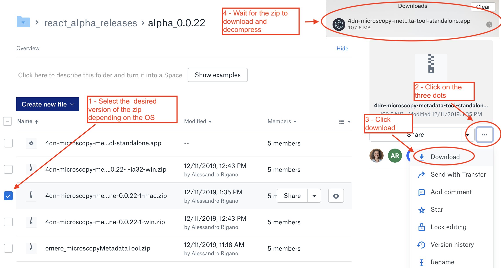
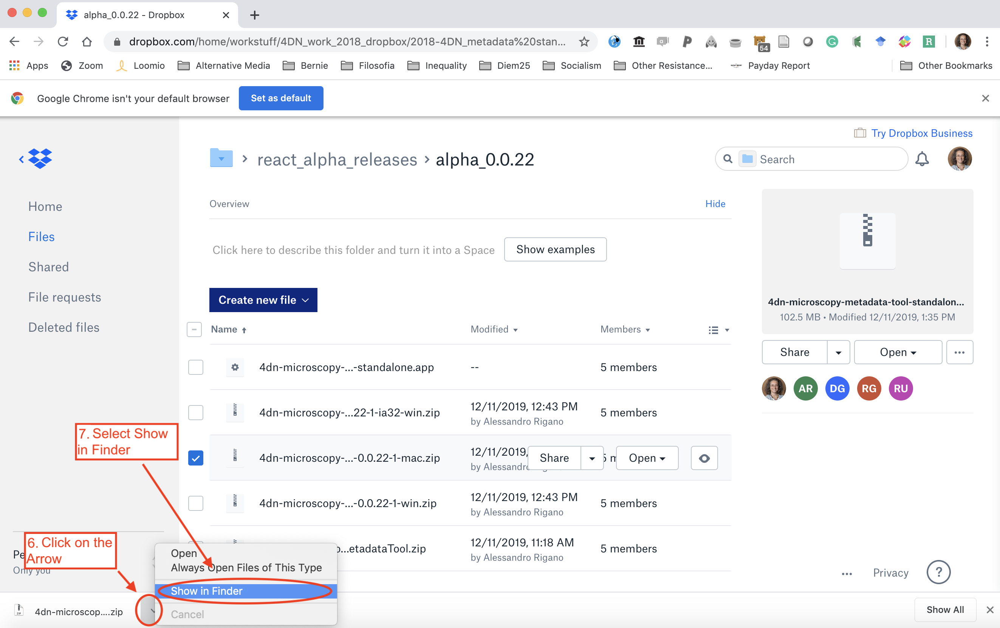
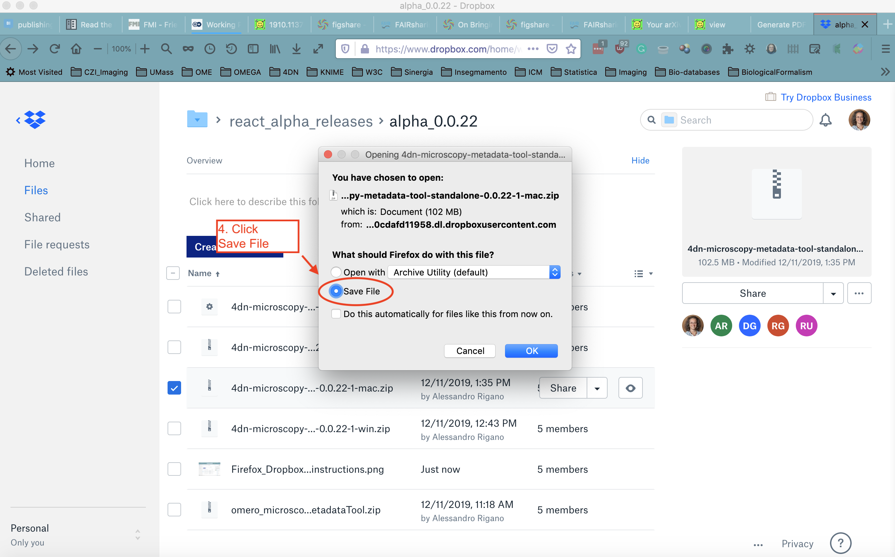

==========================
Downloading Micro-Meta App
==========================
Currently, the stand-alone version of the Micro-Meta App is made available for download from a Dropbox folder, whose link will be provided to you upon request.

In order to download and launch the Micro-Meta App from the Dropbox folder, the instructions vary slightly depending on the method you use to access Dropbox. Please follow the instructions that match the method you prefer.

************************************
A - Download from the Safari browser
************************************

  Downloading Micro-Meta App from Dropbox using Safari.

************************************
B - Download from the Chrome browser
************************************
Step 1
======

  Select the appropriate version to download depending on your operating system.

Step 2
======

  Select the destination folder for Micro-Meta App.

Step 3
======

  Locate downloaded Micro-Meta App.

Step 4
======

  Un-zip and launch Micro-Meta App.

*************************************
C - Download from the Firefox browser
*************************************
Step 1
======

  Select the appropriate version to download depending on your operating system.

Step 2
======

  Select the destination folder for Micro-Meta App.

Step 3
======
. figure:: images/download_images/Firefox_Dropbox_download-install_3.png
  :class: shadow-image
  :width: 90%
  :align: center

  Locate downloaded Micro-Meta App.

Step 4
======

  Un-zip and launch Micro-Meta App.
