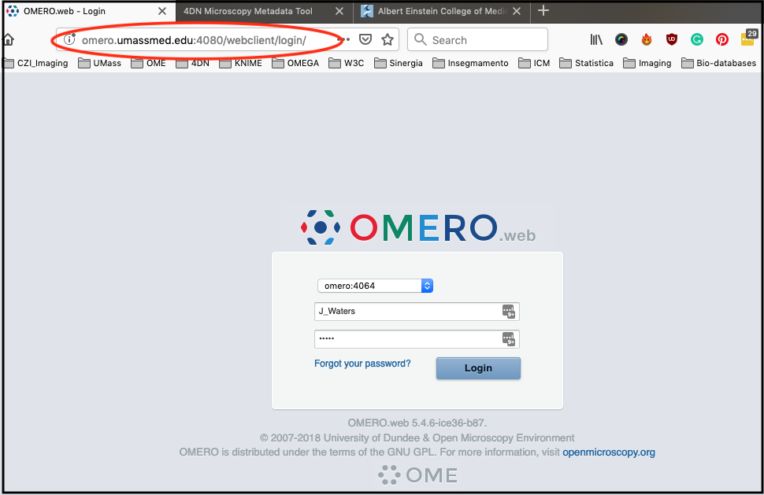
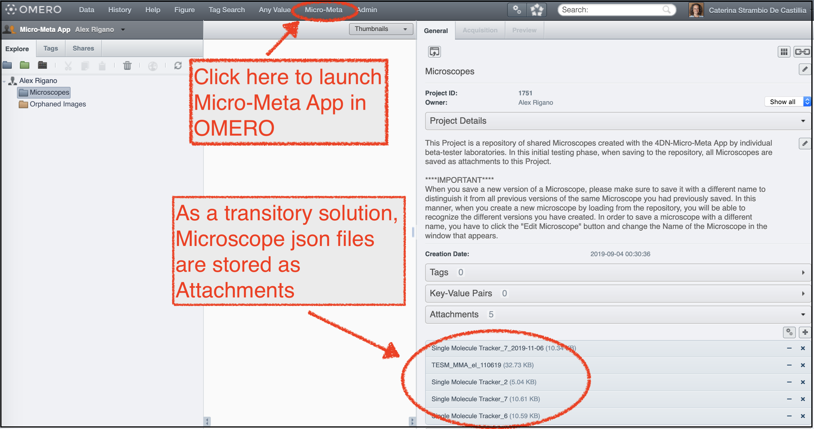

========================
Launching Micro-Meta App
========================
The instructions on how to launch Micro-Meta App differ depending on whether you are using the standalone version on your local computer, the version that is integrated into the 4DN Data Portal, or the Micro-Meta App OMERO plugin.

*******************************************************
A - Launching the standalone version of Micro-Meta App.
*******************************************************
Locate the Micro-Meta App on your local computer and double click on the icon to launch it. After launching the App select the Home folder where all saved Microscope files will be stored on your local computer and hit Confirm.

.. figure:: images/launch_images/Stand-alone_launch/01_Select_home-folder.png
  :class: shadow-image
  :width: 90%
  :align: center

  Figure 1: Select home folder where Microscope files will be locally saved.

*********************************************************
B - Launching the Micro-Meta App from the 4DN Data Portal
*********************************************************
Instructions on how to use the Micro-Meta App in the context of the `4D Nucleome Data Portal <>`_ are coming up soon.

.. figure:: images/launch_images/4DN_launch/01_Micro-Meta App_4DN.png
  :class: shadow-image
  :width: 90%
  :align: center

  Figure 2: Micro-Meta App can be used in the context of the 4D Nucleome Data Portal.

*************************************************
C - Launching the Micro-Meta App OMERO.web plugin
*************************************************
For the moment the Micro-Meta App OMERO.web plug-in is only implemented on the OMERO server instance available at UMMS-PMM. In order to use this version of the Micro-Meta App please follow the instructions below.

Step 1
======
Using your favorite browser (Firefox or Chrome are good choices) navigate to http://omero.umassmed.edu:4080/webclient/login/ to access the UMM-PMM OMERO.web client.

Step 2
======
Use the OMERO login credentials provided to you by the UMMS-PMM OMERO server administrator (if you do not have them please contact: Caterina at caterina.strambio@umassmed.edu or Alex at alessandro.rigano@umassmed.edu) to login into OMERO.

  Figure 3: Login into the OMERO server.

Step 3
======
By default, you will find yourself in the standard data management screen of OMERO and will be placed in your default group, for now, is "Micro-Meta App”.

Step 4
======
In order to see the microscopes, you will have to access the data owned by Alex Rigano (see Figure).

  Figure 4: Switch user to access the dedicated Microscopes dataset to save Microscope files.

Step 5
======
Now you will see the “Microscope” project and you will be able to see the available attached microscope-files.

  Figure 5: Launch the OMERO Micro-Meta App plugin.

Step 6
======
To launch the Micro-Meta App plugin in OMERO click on “Micro-Meta” in the top menu-bar.
