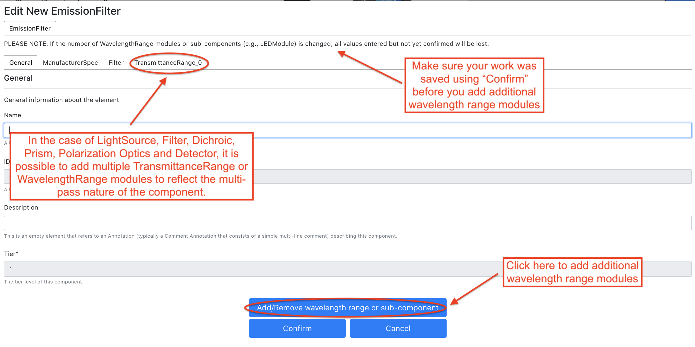

====================
Using Micro-Meta App
====================
Please follow these step by step instructions.

******************************************
A. Managing Microscope Specification files
******************************************

A.1 Selecting Tier level
========================

Step 1
------
Select the Tier level you are interested in and click on “Create microscope”.

.. .. figure:: images/use_images/01_Select-Tier_1.png
..   :class: shadow-image
..   :width: 90%
..   :align: center

.. Figure 1: Click on the Tier selection menu.

------

.. figure:: images/use_images/02_Select-Tier_2.png
  :class: shadow-image
  :width: 90%
  :align: center

  Figure 1: Select the desired Tier level.

Step 2
------
Click on “Create microscope” and select one of the three options. “Create from scratch” allows you to create a new Microscope file. “Load from file” allows you to import a Microscope file that has not been loaded in the App yet (i.e., a Microscope file you might have received from someone else). “Load from Repository” allows you to work on a Microscope file that has already been imported in the App and you might need to modify.

A.2 Creating from scratch
=========================

After selecting “Create from scratch”, hit “Confirm” and an empty Canvas will appear. To start building a new Microscope file, first hit “Edit Microscope”, enter the required attributes and hit “Confirm”. To add Hardware components follow instructions below.

A.2 Loading from file
=====================

Step 1
------
After selecting “Load from file”, hit “Confirm” and click to select an existing Microscope file obtained from a third party.

.. .. figure:: images/use_images/04_Load_from_file_1.png
..   :class: shadow-image
..   :width: 90%
..   :align: center

..  Figure 2: Select “Load from file” to open an existing third-party Microscope file.

Step 2
------
Select the desired Microscope file (i.e., those provided as Example Files with the App), click “Open” and then hit “Confirm”.

.. figure:: images/use_images/05_Load_from_file_2.png
  :class: shadow-image
  :width: 90%
  :align: center

  Figure 2: Select the desired Microscope file to open.

A.3 Loading from a repository
=============================

Step 1
------
After selecting “Load from repository”, choose the pre-existing Microscope files you need to modify and hit “Confirm”.

  Figure 3: Select “Load from repository” to open an existing Microscope file to edit.

--------

.. figure:: images/use_images/07_Load_from_repository_2.png
  :class: shadow-image
  :width: 90%
  :align: center

  Figure 4: Select the desired Manufacturer and Microscope file from those available in the repository.

Step 2
------
The desired Microscope file will open and all pre-existing Hardware components will appear on the Canvas.

.. figure:: images/use_images/08_Open_Microscope.png
  :class: shadow-image
  :width: 90%
  :align: center

  Figure 5: Open the desired Microscope file.

B. Adding and Editing Hardware components to the Canvas
=======================================================

Step 1
------
In order to add an additional Hardware component, select and open one of the sections [1] on the right panel, and select a new element to add [2]. In this example, we are selecting and adding a new Objective to the Canvas.

.. figure:: images/use_images/09_Add_new_Objective.png
  :class: shadow-image
  :width: 90%
  :align: center

  Figure 6: Add a new Objective component to the Microscope canvas.

Step 2
------
A newly added element will appear with a red box around it indicating that metadata values are missing and that the component is not validated. In order to enter metadata values, click on the element to open the associated form.
Fields that are mandatory for the Tier-validation level you have selected are marked by an asterisk. After entering metadata values, when you click “Confirm” the App will take you to fields (marked by red error messages) that are still missing and need to be filled in to complete validation.

  Figure 7: Edit Objective’s attributes.

-----

.. figure:: images/use_images/11_Confirm_attributes.png
  :class: shadow-image
  :width: 90%
  :align: center

  Figure 8: Enter the required Objective’s attributes and Confirm to validate.

Step 3
------
In the case of Filters, Dichroic, and LED light sources, it is possible to add multiple Transmittance, Reflectance, and Wavelength Ranges to reflect the multi-pass nature of the component. In order to add additional band-pass components click on “Edit Component”.  In order to edit the number of band-pass components click on + or -.  IMPORTANT: if you change the number of band-pass components after you have started adding values in the metadata fields, all un-saved values previously entered will be lost (this is obviously not great and we are planning to fix this issue in a future release. For now please accept our apologies for the temporary inconvenience).

  Figure 9: Add the required number of Transmittance Range components to correctly describe a multi-pass Excitation filter.

C. Saving Microscope files
==========================

When you are done with all the editing the Microscope file can be saved to the Repository or Home folder or exported as a file.

  Figure 10: Save the edited Microscope file.
